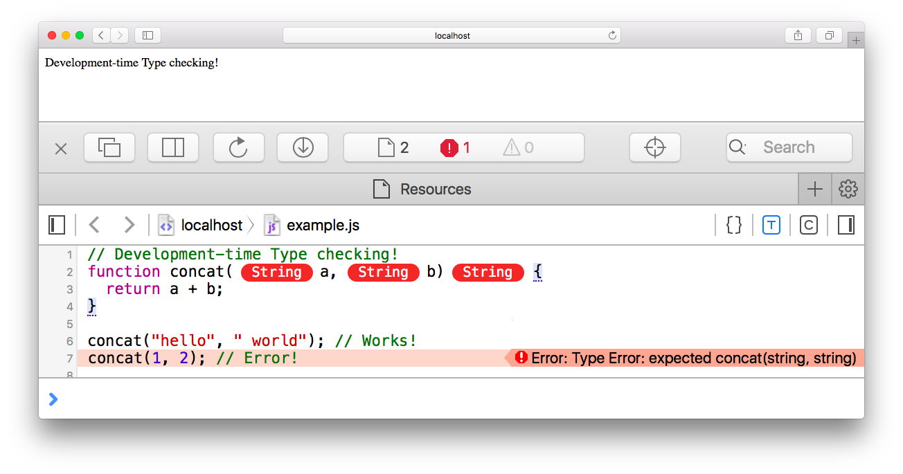

This is a [stage 0](https://tc39.github.io/process-document/) proposal to add a [pluggable type system](http://bracha.org/pluggableTypesPosition.pdf) to JavaScript.

A **pluggable** type system is a set of [syntactical constructs](#syntax) that serve as type **annotations** that formally bind them to an **optional type checker** (i.e. no assertions made at runtime) defined in  **userland** (e.g. typescript, flow and closure). For example:

```javascript
function add(x: number, y: number): number {
    return x + y;
}
```

Is equivalent to:

```javascript
function add(x /*: number */, y /*: number */) /*: number */ {
    return x + y;
}
```

You bind a type system plugin to code by using a **to-be-determined-at-stage-2** convention ([alternatives](#binding)), for example:

```javascript
// @types https://www.typescriptlang.org/
```

# Motivation

Pluggable type systems have no type checking/enforcement at runtime (as opposed to, say, [gradual](http://code.sgo.to/proposal-optional-types/FAQ.html#sound-gradual-typing) type systems). Their benefits are mostly materialized while writing/reading code.

Pluggable type systems empowers:

1. typescript/flow users
1. closure users
1. vanilla javascript users
1. TC39

For **syntax-based** type system users (e.g. typescript and flow), it empowers them by making them part of a supported/compatible/standard language extension (type system plugins). It enables browsers/node (which takes vanilla javascript) to take typed code natively and plug them in with developer tools (e.g. through a [language server protocol](https://github.com/Microsoft/language-server-protocol)).



For [@comments-based](http://usejsdoc.org/) type systems user's (e.g. closure compiler, which, by design, wants to be strictly under the standard grammar), it enables them to move to natively supported syntax, improving ergonomics while still maintaining **backwards compatibility** with their existing type system. For example:

```javascript
/**
 * @constructor
 * @implements {Shape}
 */
function Square() {};
Square.prototype.draw = function() {
  ...
};
```

Which, with the syntax extensions, enables them to be written as:

```javascript
class Square implements Shape {
  ...
}
```

For users, in isolation, the basic syntax of a pluggable type systems enables **code navigation** (e.g. ctrl-click jumps to definition) in code editors (e.g. developer tools in browsers).


For TC39, pluggable type systems enable:

1. the ability to steer **convergence** on syntax of type systems for JS 
1. the **delegation** of the development/innovation of type **semantics** to userland
1. the formalization of **current norm**
1. a **stepping stone** on the path towards finding a unified [optional type system](http://code.sgo.to/proposal-optional-types/)

Having said that, the main **drawback** with pluggable type systems for TC39 it that they corner ourselves from **gradual typing** (i.e. once introduced without runtime type checking, they can't add them afterwards without introducing extra syntax).

We believe, however, that there is significant evidence in the research literature that gradual typing incurs a significant performance penalty, which makes it impractical. In addition, TypeScript, Flow, and Closure Compiler have demonstrated that optional typing works well for JS at scale.

# Strawman proposal

In this proposal, we describe syntactical extensions that enables type plugins to define semantics. At runtime, every extension below is semantically sequivalent to wrapping them in ```/* */``` comments.

## Binding

We believe it is important to make an association between the syntax and the type checking semantics to be performed. Currently, to the best of our knowledge, each type system has their own convention:

* file extensions (e.g. [```.flow```](https://github.com/facebook/flow/issues/1996#issuecomment-230919868) or ```.ts```).
* reserved ```// @``` comment annotations (e.g. [```// @flow```](https://flow.org/en/docs/usage/#toc-prepare-your-code-for-flow) source annotation).
* ```jsdocs``` annotations.
* ```"use pragmas"``` pragmas.

We should take these (and more) into consideration:

* does it require TC39 to enumerate/register type systems or can it be self-service?
* does the binding happen in the source code or out of band (e.g. compilation flag, file extensions, etc)?

As a starting point, consider a reserved jsdoc annotation (e.g. ```@types```) pointing to a URL (along the lines of xml namespaces) which is responsible to define how types should be interpreted.

For example:

```javascript
/**
 * This class abstracts X, Y and Z.
 *
 * @types https://www.typescriptlang.org/
 */
```

## Syntax

In addition to the binding mechanism, we propose syntactical extensions for type annotations.

### Variables

```javascript
let isDone: boolean = false;
let decimal: number = 6;
let hex: number = 0xf00d;
let binary: number = 0b1010;
let octal: number = 0o744;
let color: string = "blue";
let list: number[] = [1, 2, 3];
let x: [string, number] = ["hello", 10]; // tuples
let notsure: any = 4;
let u: undefined = undefined;
let n: null = null;
```

### Functions

```javascript
function add(x: number, y: number): number {
    return x + y;
}

let mul: (x: number, y: number) => number =
    function(x: number, y: number): number { return x * y; };

function vote(candidate: string, callback: (result: string) => any) {  
   // ...  
}
```

Optional parameters:

```javascript
function buildName(firstName: string, lastName?: string) {
  if (lastName) {
    return firstName + " " + lastName;
  } else {
    return firstName;
  }
}
```

### Classes

```javascript
class BankAccount {  
  balance: number;  
  constructor(initially: number) {  
    this.balance = initially;  
  }  
  deposit(credit: number) {  
    this.balance += credit;  
    return this.balance;  
  }  
}
```

### Interfaces

```javascript
interface Timer {
  currentTime: Date;
  setTime(d: Date);
}

class Clock implements Timer {
  ...
}
```

### Generics

```javascript
interface Array<T> {  
    reverse(): T[];  
    sort(compareFn?: (a: T, b: T) => number): T[];  
    // ...   
}

function identity<T>(arg: T): T {
    return arg;
}

class GenericNumber<T> {
    zeroValue: T;
    add: (x: T, y: T) => T;
}
```

# Related Work

* [Other languages](http://code.sgo.to/proposal-optional-types/FAQ.html#other-languages)
* [TC39 discussions](http://code.sgo.to/proposal-optional-types/FAQ.html#tc39-discussions)
* [An Optional Type System for JS](http://code.sgo.to/proposal-optional-types/)
